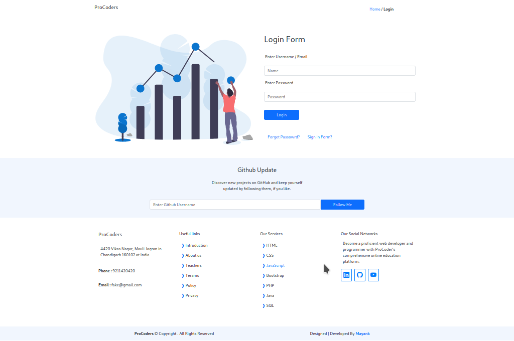

# ProCOder
### Your Path to Mastering Web Development and Programming

## Feedback

ProCoder is a comprehensive online education plathform dedicated to helping you become a proficient to helping you become a proficient web developer and programmer. Our course cover a wide range of technologies, including __HTML__,__CSS__,__JavaScript__,__PHP__,__Java__, and __SQL__ equipping you with the knowledge and skills to excel in the world of coding.

<!--

# website-16

- Name : "ProCoder"

- Description : "Learn Bootstrap to make good or simple website layout with minmum components us"

- Version : 1.3

- Update : 10-10-2023

- Status : REST

- Responsive : True

- TecStack : { HTML | CSS | JavaScript | Bootstrap }

- Thanks : { VSCode | GitHub | Bootstrap-Icons | Freepik }

- Work : Self

- Design : { Mayank }

- Developer : { Mayank }

- CopyRight : { ProCoder }

- URL : https://mayankdevil.github.io/website-16/

- Clone : https://github.com/MayankDevil/website-16.git

- Download : https://github.com/MayankDevil/website-16/archive/refs/heads/main.zip

---

### Home Page

## Responsive

_this website is very responsive webpages, thanks by bootstrap framewrok_

**SCREEN** { 1200PX | 992PX | 785PX | 556PX }

## INFOMATION

_this is self learning website that my first aproch to learn bootstrap not make tutorial website. it not claim to any course._

